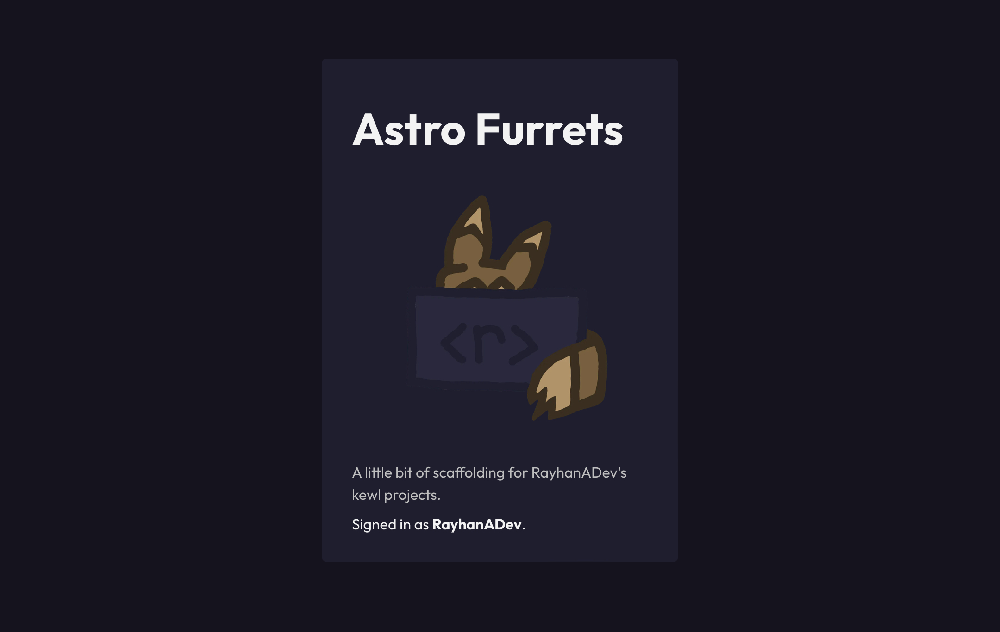

# Welcome to [Astro](https://astro.build)

> 🧑‍🚀 **Seasoned astronaut?** Delete this file. Have fun!



## 🏗 Astro Furrets

Astro Furrets is my ([@RayhanADev](https://www.furret.codes)) preferred scaffolding for most projects! It features:

- a blazing fast and lightweight [Astro](https://astro.build) client
- lightweight and extensive [Koa.js](https://koajs.com) server
- image optimization via `astro-imagetools`
- [Tailwind CSS](https://tailwindcss.org) preconfigured with [furret.css](https://css.furret.codes) themes and fonts + additional PostCSS configuration
- layout with SEO metadata preconfigured, along with brand favicons, webmanifest, and sitemap data
- login and user data via custom ReplAuth authentication and store logic
- faster inline scripts with [Partytown](https://partytown.builder.io/)
- analytics scaffolding for [my Umami](https://umami.furret.codes) dashboard
- and more little additions! 🚀

I open sourced it for people to use if it suits their fancy. 🎩

## 🚀 Project Structure

Inside of your Astro project, you'll see the following folders and files:

```
/
├── public/
│   └── favicon.svg
├── src/
│   ├── components/
│   │   └── Card.astro
│   ├── layouts/
│   │   └── Layout.astro
│   └── pages/
│       └── index.astro
└── package.json
```

Astro looks for `.astro` or `.md` files in the `src/pages/` directory. Each page is exposed as a route based on its file name.

There's nothing special about `src/components/`, but that's where we like to put any Astro/React/Vue/Svelte/Preact components.

Any static assets, like images, can be placed in the `public/` directory.

## 🧞 Commands

All commands are run from the root of the project, from a terminal:

| Command                | Action                                             |
| :--------------------- | :------------------------------------------------- |
| `npm install`          | Installs dependencies                              |
| `npm run dev`          | Starts local dev server at `localhost:3000`        |
| `npm run build`        | Build your production site to `./dist/`            |
| `npm run preview`      | Preview your build locally, before deploying       |
| `npm run astro ...`    | Run CLI commands like `astro add`, `astro preview` |
| `npm run astro --help` | Get help using the Astro CLI                       |

## 👀 Want to learn more?

Feel free to check [our documentation](https://docs.astro.build) or jump into our [Discord server](https://astro.build/chat).
